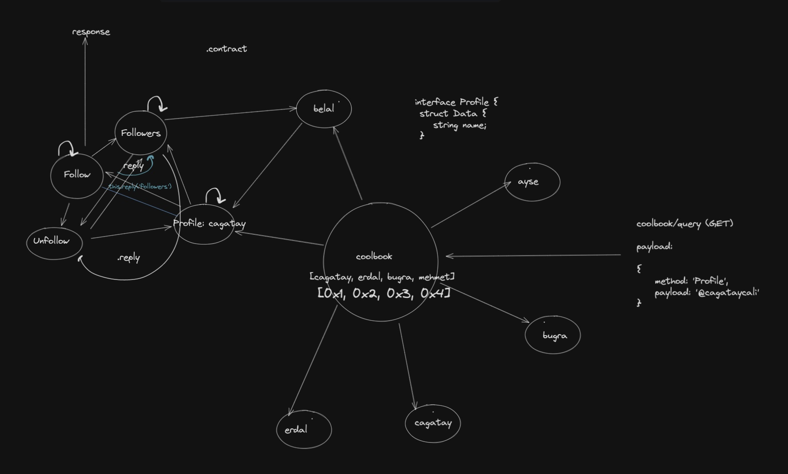

 # CoolBook

 CoolBook is a social media, where you can share your thoughts and ideas with others.

 Demonstration of web3 based networking application running top of **HSTP**.

 Creation of profile is implemented. You can create a profile, add a profile picture, change your profile picture, change your username.

 > Implementation is not fully functional, for CoolBook.
 > HSTP implementation is done but CoolBook is not tested, there could be a lot of small mistakes I made.

 